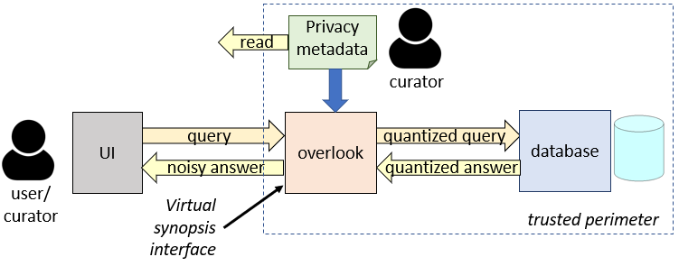
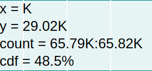
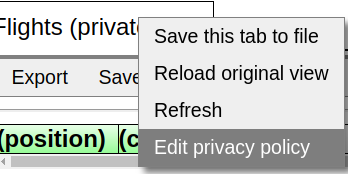
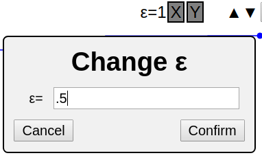

# Hillview for differentially-private visualizations

We are experimentally adding support to Hillview for
[differentially-private](https://en.wikipedia.org/wiki/Differential_privacy)
visualizations.  This is work in progress.

A [video](https://1drv.ms/v/s!AlywK8G1COQ_lJMxl9cantTOlvRawA?e=k1VKSL)
of Hillview being used to visualize differentially-private data is
available.

Visualizations preserve privacy by adding noise to the results prior
to the visualization; the noise added can be positive or negative.
Note that the noise added may cause values existing in the data
not to be shown, or, conversely, values that do not exist in the
dataset to be shown with high confidence.

In Hillview differentially-private views have an epsilon sign on each
page: ε.  Hillview protects the privacy of each individual *row* in a
dataset.

## Overlook system architecture

Differential privacy is added by an interposition layer called
*Overlook* which intercepts requests from the UI, rewrites them based
on a *privacy policy*, and sends them to the back-end.  Overlook
intercepts the results from the back-end and adds noise to them before
returning them to the UI.

If Overlook detects that a dataset has an associated privacy policy it
will automatically display it using differential privacy.



A *data curator* is an authorized user who can modify the privacy
policy.  Currently the privacy policy is stored in a JSON file
residing on the root node, and which can attached to any data source.

(Currently Hillview allows any user to act as a data curator, but in a
production system the curator would have to be authenticated.)

## Missing functionality

Many Hillview visualizations are unavailable when using differential
privacy.  In particular, the table view has very restricted
functionality - one cannot inherently browse individual rows of a
dataset when using differential privacy.

## Privacy policy

The following shows an excerpt from a privacy policy for a table with
4 columns: `OriginState` (String), `Origin` (String), `DepTime` (Numeric), and
`DepDelay` (Numeric).

The privacy allocates a *privacy budget* epsilon for each set of
columns.  The privacy budget describes the amount of information that
can be leaked when data in the corresponding set of columns is
visualized.  In the following example the epsilon for the column
`Origin` is set to 2, epsilon for zero columns (used when displaying the
total number of rows) is set to 1, epsilon for any other 1 column is
set to 1.5, epsilon for any pair of columns is set to 0.1.  (`defaultEpsilons` 
maps a column count to a privacy value.)

The privacy policy also specifies for each column a *quantization
policy*: the values in the column are rounded down using the
quantization policy.  For the `OriginState` column the quantization
points are exactly the 50 US states.  For the `Origin` column the
quantization points are the uppercase letters of the alphabet.  The
`DepTime` column has a range of 0 to 2400 and each value is rounded down
to a multiple of 5.

```JSON
{
  "epsilons": { "Origin": 2 },
  "defaultEpsilons": {
    "0": 1,
    "1": 1.5,
    "2": 0.1
  },
  "quantization": {
    "quantization": {
      "OriginState": {
        "type": "StringColumnQuantization",
        "globalMax": "a",
        "leftBoundaries": ["AK", "AL", "AR", "AZ", "CA", "CO", "CT", "DE", "FL", "GA", "HI", "IA", "ID", "IL", "IN", "KS", "KY", "LA", "MA", "MD", "ME", "MI", "MN", "MO", "MS", "MT", "NC", "ND", "NE", "NH", "NJ", "NM", "NV", "NY", "OH", "OK", "OR", "PA", "RI", "SC", "SD", "TN", "TX", "UT", "VA", "VT", "WA", "WI", "WV", "WY"]},
      "Origin": {
        "type": "StringColumnQuantization",
        "globalMax": "a",
        "leftBoundaries": [ "A", "B", "C", "D", "E", "F", "G", "H", "I", "J", "K", "L", "M", "N", "O", "P", "Q", "R", "S", "T", "U", "V", "W", "X", "Y", "Z"]
      },
      "DepTime": {
        "type": "DoubleColumnQuantization",
        "granularity": 5,
        "globalMin": 0,
        "globalMax": 2400
      },
      "DepDelay": {
        "type": "DoubleColumnQuantization",
        "granularity": 1,
        "globalMin": -100,
        "globalMax": 1000
      }
    }
  }
}
```

## Browsing private data

In general, when browsing differentially-private only queries that
count objects can be executed.  Overlook also supports filtering data
on contiguous ranges.

For each column data that is outside the quantization range is treated
as *missing* values.

Below we only describe how visualizations differ from their non-private counterparts.
For a detailed description see the [Hillview user manual](docs/userManual.md).

An important feature of private visualization is that no counts are
displayed precisely: each data count has some noise added, to protect
the privacy of the data.  To aid the user Hillview will display counts
either using an approximate sign (≈), or a range (e.g. count = 10.3K :
10.4K).  The displayed range of the count is in fact a *95% confidence
interval*, but with probability 5% a count could in fact be outside the
shown confidence interval.  In particular, using
differentially-private visualization on can never ascertain whether a
certain value is present in a given dataset.  The count displayed may be
non-zero even for values that do not exist at all.

### Browsing metadata

Mousing over a column header shows the metadata associated with that column.

Estimating the number of distinct values in a column will return a
noisy value.  For columns with a low distinct count the noise will
probably exceed the true count almost always.

### Charting

For private data currently the only charting options are
histograms/pie charts, heatmaps and Trellis plots of histograms.  This
functionality can be extended in the future to encompass 
2D histograms and the other Trellis plots.

#### Histograms

Histogram plots with private visualizations differ in the following ways from 
non-private histograms:

* Counts are displayed as ranges.



* The total count and the missing count are noisy
* The bucket boundaries shown are always aligned to quantization boundaries.
For example, for the `Origin` column one can only display a count
of the number of entries that start with each letter of the alphabet.
* Zooming-in will not snap to the actual range of the present data

#### Pie charts

For pie charts the count and percentage of each slice is shown as a range (however, if 
all displayed digits of a range are the same -- e.g., 9.3K, 
the range may be displayed as a single value).

#### Heatmaps

For heatmaps the chart will only display the data that has high enough
confidence (count > threshold * confidence_interval).  The view menu
offers the ability to change the threshold from it's default value of 2.  

When mousing-over a cell in a heatmap the value will be displayed
as a range; simultaneously, the range is shown on the legend above.
Note that the range will be non-empty even for cells shown with a
white background -- due to low confidence.


## Data curator functionality

The data curator can compute various statistics of the data, like any
other user.  The curator can also edit the privacy
policy directly as a JSON file, by opening a menu using right-click
from the dataset tab:



The curator can also click on the little epsilon icon to edit its
value directly for the displayed columns:


